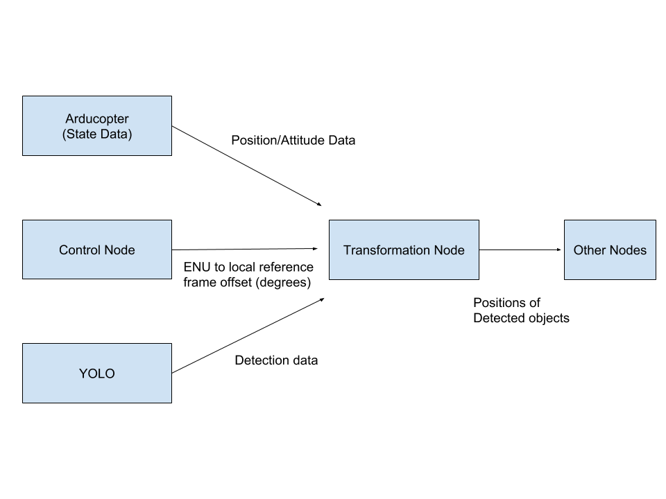

# Object Contextualization with Monocular Camera for a UAV 

This package is designed to work hand in hand with YOLO and Ardupilot to give the UAV awareness of where detected objects are in the UAV's navigational frame. This package uses the intrinsics of the camera (the field of view) as well as the mounting angle and the Drone's position. 

## Why use this package? 

In order to get the position of a detection the traditional solution is to use a stereo camera. However, stereo cameras have 2 significant drawbacks. 

> **1.) They are much hevier than monocular cameras**
> 
> **2.) Stereo algorithms require more computational processing**

By using this package your UAV will have more available computational power and be physically much lighter (This can create significant flight time increases)

## What are the limitations of this package?

This package make 2 key assumptions
> **1.) Detected objects reside on the ground**
>
> **2.) Detected object's height are much less than the altitude of the drone**

## Original Use Case 

This package was orginally used to detect roombas for IARC's mission 7. The position of all the roombas fed back to a state machine running onboard the drone which then made decisions on which roombas to pursue. 

https://www.youtube.com/watch?v=aa4U99KyjN4

## Information Flow Chart



## Dependencies

- darknet_ros
- iq_control_node

```
cd ~/catkin_ws/src
git clone https://github.com/Texas-Aerial-Robotics/darknet_ros.git
```
## Installaton

```
cd ~/catkin_ws/src
git clone https://github.com/Texas-Aerial-Robotics/Transformations-Ros.git
```

## Build 

```
catkin build
```

## Running package 

To test your system use the gazebo + ardupilot SITL simulation 

TODO make general instructions for running gazebo + ardupilot SITL simulation 

Run YOLO 
```
roslaunch darknet_ros darknet_ros.launch
```

Run Transformation node 
```
roslaunch transformations_ros transformations.launch  
```
