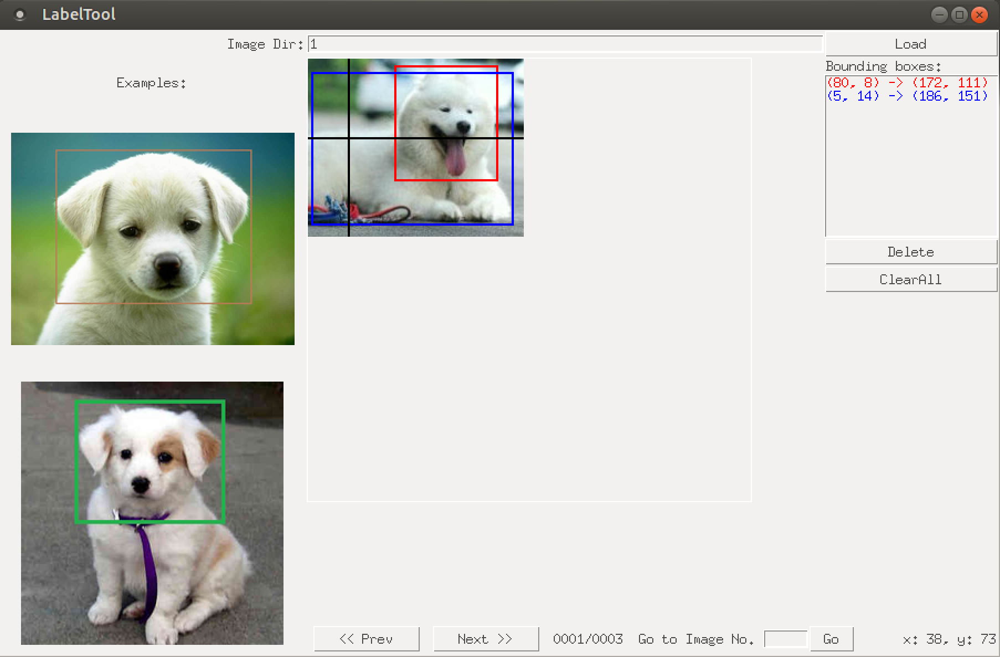

Training YOLO with BBox-Label-Tool
==================================

A simple tool for labeling object bounding boxes in images, implemented with Python Tkinter.

## Dependencies

```
sudo apt-get install python-imaging-tk
```

## Training instructions

The following are a modified version of the instructions found on the yolo website

1. Strat by collecting images. the goal is to collect close to 500 img/class 
2. create a new folder in BBox-Label-Tool/Images  
3. For multi-class task, modify 'class.txt' with your own class-candidates and before labeling bbox, 
4. run main.py and annotate images. The current tool requires that **the images to be labeled reside in /Images/001, /Images/002, etc. You will need to modify the code if you want to label images elsewhere**. For multi-class choose the 'Current Class' in the Combobox and make sure you click 'ComfirmClass' button. 
5. To create a new bounding box, left-click to select the first vertex. Moving the mouse to draw a rectangle, and left-click again to select the second vertex.
  - To cancel the bounding box while drawing, just press `<Esc>`.
  - To delete a existing bounding box, select it from the listbox, and click `Delete`.
  - To delete all existing bounding boxes in the image, simply click `ClearAll`.
6. After finishing one image, click `Next` to advance. Likewise, click `Prev` to reverse. Or, input an image id and click `Go` to navigate to the speficied image.
  - Be sure to click `Next` after finishing a image, or the result won't be saved. 
7. run the convert.py script to format the annotations in yolo form 
8. combine jour dataset_list files using your favorite text editor into train.txt and test.txt. It is recommended to not train on one of your data sets to use as a accuracy metric. 
9. Set up the darknet config. 

- Create a file in darknet/cfg with the name <nameofdata>.data 
- Create a folder to store the output weights in. ex /home/eric/backup     
```
  1 classes= 20
  2 train  = <path-to-data>/train.txt
  3 valid  = <path-to-data>/test.txt
  4 names = data/voc.names
  5 backup = <path-to-backup-folder>
```
10. run `./darknet detector train cfg/<nameofdata>.data cfg/yolov3.cfg <weights(if you want to continue training from a backup)>`


**Screenshot:**


Data Organization
-----------------
LabelTool  
|  
|--main.py   *# source code for the tool*  
|  
|--Images/   *# direcotry containing the images to be labeled*  
|  
|--Labels/   *# direcotry for the labeling results*  
|
|--Labels-Yolo-Format *# direcotry for the labeling results in yolo readable format*   
|  
|--Examples/  *# direcotry for the example bboxes*  

